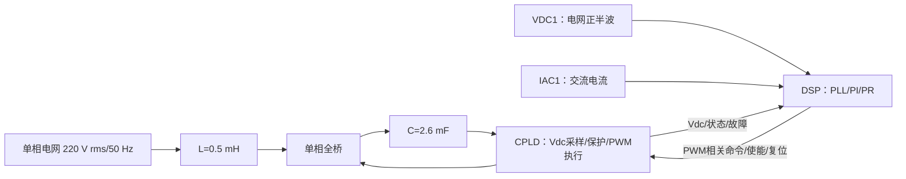

# 单相STATCOM 3号CCS工程系统框图与分阶段验证计划

## 1. 文档定位

本文件描述DSP、CPLD和单相全桥之间的控制与通信框架，用于后续逐步实现和上板验证。它不替代电气原理图、接线图、隔离设计、门极驱动时序和保护定值表。

标记规则：`已确认`表示已由现有工程或用户硬件信息确认；`继承待复测`表示来自2号工程但需在3号工程重新上板；`待确认`表示必须根据CPLD活动顶层、硬件连线或实测冻结。

## 2. 总体系统框图

可编辑源文件：`01_系统总体框图.mmd`。



## 3. 控制目标与信号定义

STATCOM模式下，直流侧不承担持续有功负载。电压外环只产生很小的有功电流指令`Ip*`，用于补偿开关、导通、电抗器和辅助电源损耗，使直流母线保持目标值。用户通过`Iq*`设定无功电流。

电流指令采用：

```text
i_ref(t) = Ip* sin(theta) - Iq* cos(theta)
```

其中正负号与电流传感器方向有关，必须在低压、小电流条件下确认。目标PR形式为：

```text
G_PR(s) = Kp + (2 Kr wc s)/(s^2 + 2 wc s + w0^2)
```

PLECS起始值为`Kp=0.8`、`Kr=10`、`wc=2π×5 rad/s`、`w0=2π×50 rad/s`。这些只是影子模式和低压整定起点，不是直接上板定值。PI低压起始值为`Kp=0.15`、`Ki=0.8`，输出先限幅到`±3 A峰值`。

## 4. 节点与接口表

| 编号 | 节点/接口 | 方向 | 当前定义 | 状态 |
|---|---|---|---|---|
| A1 | ADCINA0/VDC1 | 模拟量→DSP | 电网隔离正半波，用于重构与PLL | 已确认用途，比例待标定 |
| A2 | ADCINA1/IDC1 | 模拟量→DSP | 预留直流电流/诊断通道 | 继承待复测 |
| A3 | ADCINA2/IAC1 | 模拟量→DSP | 电抗器交流电流反馈 | 已确认用途，零漂/比例待标定 |
| C1 | CPLD→DSP光纤 | CPLD→DSP | Vdc、状态、故障、心跳 | 功能已存在，最终协议待冻结 |
| C2 | DSP→CPLD光纤 | DSP→CPLD | STOP/RUN、复位、PWM相关信息 | 物理形式、帧周期待确认 |
| P1 | CPLD→门极 | CPLD→全桥 | 互补PWM、死区、封锁 | CPLD侧基本完成，需联调 |

## 5. 已确认参数与暂定参数

| 参数 | 数值 | 性质 |
|---|---:|---|
| DSP | TMS320F28062，SYSCLK 90 MHz | 2号工程已确认 |
| 电网 | 220 V rms，50 Hz | 目标额定输入 |
| 低压首次调试 | 50 V rms，Vdc*=80 V | 暂定安全起点 |
| 电抗器 | 0.5 mH | 硬件已确认 |
| 直流电容 | 4×650 uF并联=2.6 mF | 硬件已确认 |
| ADC/控制触发 | 20 kHz，ePWM1 SOCA，TBPRD=4499 | 3号通信/PLL阶段已实现 |
| ADC参考 | 外部3.0 V | 继承2号工程 |
| IAC换算 | 0.09887695 A/count | 继承值，必须实测标定 |
| 调制限幅 | ±0.95 | 仿真起始值 |
| 功率/额定电流 | 尚未冻结 | 取决于器件、电感饱和、母线和散热 |

## 6. 分阶段实施与上板验收

### 阶段0：工程独立与安全基线

目标：3号工程可独立导入、编译，2号工程不变。`STATCOM_POWER_OUTPUT_ENABLED=0`，所有CPLD命令保持STOP。验收：CCS无错误；上电后GPIO/SCI/ADC不死机；功率驱动保持封锁。

### 阶段1：三路ADC与传感器标定

只运行ADC。用示波器和CCS同时观察`adc_sample`、`adc_value`、`statcom_runtime.grid_halfwave_v`及`grid_current_a`。先零电流完成1024点校零，再用标准低压源/电流源标定比例。验收：VDC1确为正半波而非平滑母线电压；电流零点稳定；极性有记录。

### 阶段2：光纤只读通信

已冻结为115200 8N1 Modbus RTU：DSP SCI-A主站轮询地址1的CPLD，SCI-B作为地址2从站供上位机查询。START/STOP只记录和回读，功率输出硬封锁。验收：持续运行30 min无持续CRC错误；拔掉光纤后500 ms内DSP标记离线。

### 阶段3：SOGI-PLL监视模式

PLL已按20 kHz移植，一周期滑动窗口为400点；每个ADC样本固定执行，只观察`raw/mean/centered/alpha/beta/theta/frequency/locked`，不接管PWM。验收：45～55 Hz范围可靠锁定；信号消失立即解锁；`adc_isr_max_cycles`小于1350周期（15 us）。

### 阶段4：PI/PR影子运算

按实测比例在ADC节拍中计算`Ip*`、`Iq*`、`i_ref`、PR输出和调制量，但仍不下发PWM。将结果与PLECS同工况记录对比，并测ISR/运算最大时间。验收：无NaN、无积分饱和失控；最坏执行时间满足20 kHz实时预算。

### 阶段5：冻结实时PWM接口

确认DSP究竟通过独立高速光纤传PWM边沿，还是传调制量由CPLD本地产生PWM。当前115200 Modbus链路不能承担20 kHz逐周期PWM或多字节调制更新。完成专用接口时序、丢帧保持、超时封锁和序号策略后，才允许进入功率测试。

### 阶段6：低压开环与极性检查

使用隔离调压器，从低电压开始；初始50 V rms、Vdc约80 V，电流限值不超过3 A峰值。先验证门极互锁、死区、电感电流方向、`vg-vpr`符号和急停链路。此阶段不得连接220 V市电。

### 阶段7：PR电流闭环

固定`Ip*=0`，从`Iq*=0.2 A`逐步增加到0.5 A、1 A、2 A；每步检查电流相位、THD、PR限幅和器件温升。验收后才提高电流。

### 阶段8：PI电压外环

先令`Iq*=0`，启动PI使`Ip*`只补偿损耗并稳住Vdc。采用给定斜坡、反馈低通、积分抗饱和和总电流圆限幅。验收：Vdc目标变化与小扰动恢复稳定，电流不过限。

### 阶段9：STATCOM组合运行

维持Vdc目标，同时阶跃改变`Iq*`。采用`Ip*^2+Iq*^2 <= Ipk_max^2`总峰值约束，优先保证母线能量平衡或按产品策略分配。验证正负无功、光纤丢失、过流、过压、驱动故障、复位和再次启动。

### 阶段10：逐级升压

只有低压全部验收后，才按明确的电压阶梯和电流降额向220 V推进。每一级保存波形、标定值、保护动作和软件版本，不跨级直接试验。

## 7. 3号工程当前观察变量

首次导入后建议添加到CCS Expressions：

```text
system_startup_stage
adc_sample_count
adc_overflow_count
adc_zero_calibration.state
adc_zero_calibration.iac_offset_count
adc_sample.vdc_raw
adc_sample.iac_raw
adc_value.vdc_pin_v
adc_value.iac_pin_v
adc_value.iac_a
statcom_runtime.state
statcom_runtime.grid_halfwave_v
statcom_runtime.grid_current_a
statcom_runtime.output_permitted
cpld_link_command.run_enable
```

正确的首版结果必须是`statcom_runtime.state=ADC_VERIFY`、`output_permitted=0`且`run_enable=0`。

## 8. 进入下一阶段前必须确认的问题

1. VDC1硬件前端的实际变比、极性和是否只保留正半波。
2. IAC1传感器额定值、零点、A/count以及电流正方向。
3. CPLD当前下载版本对应哪一套光纤协议和具体引脚。
4. DSP到CPLD传输的是PWM边沿、占空比/调制量，还是仅状态命令。
5. 功率器件、电感饱和电流、母线电容纹波电流和散热允许的额定电流。
